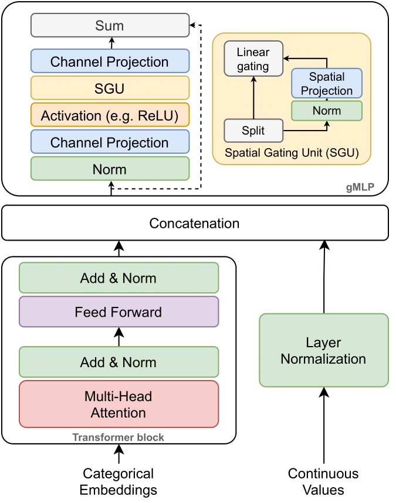

# The GatedTabTransformer.

A deep learning tabular classification architecture inspired by [TabTransformer](https://arxiv.org/abs/2012.06678) with integrated [gated](https://arxiv.org/abs/2105.08050) multilayer perceptron.

</img>

## Usage

```python
import torch
import torch.nn as nn
from gated_tab_transformer import GatedTabTransformer

model = GatedTabTransformer(
    categories = (10, 5, 6, 5, 8),      # tuple containing the number of unique values within each category
    num_continuous = 10,                # number of continuous values
    transformer_dim = 32,               # dimension, paper set at 32
    dim_out = 1,                        # binary prediction, but could be anything
    transformer_depth = 6,              # depth, paper recommended 6
    transformer_heads = 8,              # heads, paper recommends 8
    attn_dropout = 0.1,                 # post-attention dropout
    ff_dropout = 0.1,                   # feed forward dropout
    mlp_act = nn.LeakyReLU(0),          # activation for final mlp, defaults to relu, but could be anything else (selu, etc.)
    mlp_depth=4,                        # mlp hidden layers depth
    mlp_dimension=32,                   # dimension of mlp layers
    gmlp_enabled=True                   # gmlp or standard mlp
)

x_categ = torch.randint(0, 5, (1, 5))   # category values, from 0 - max number of categories, in the order as passed into the constructor above
x_cont = torch.randn(1, 10)             # assume continuous values are already normalized individually

pred = model(x_categ, x_cont)
print(pred)
```

## Citation

```
@software{gTabTransformer,
  author = {{Radostin Cholakov, Todor Kolev}},
  title = {The GatedTabTransformer.},
  url = {https://github.com/radi-cho/gTabTransformer},
  version = {0.0.1},
  date = {2021-12-15},
}
```
