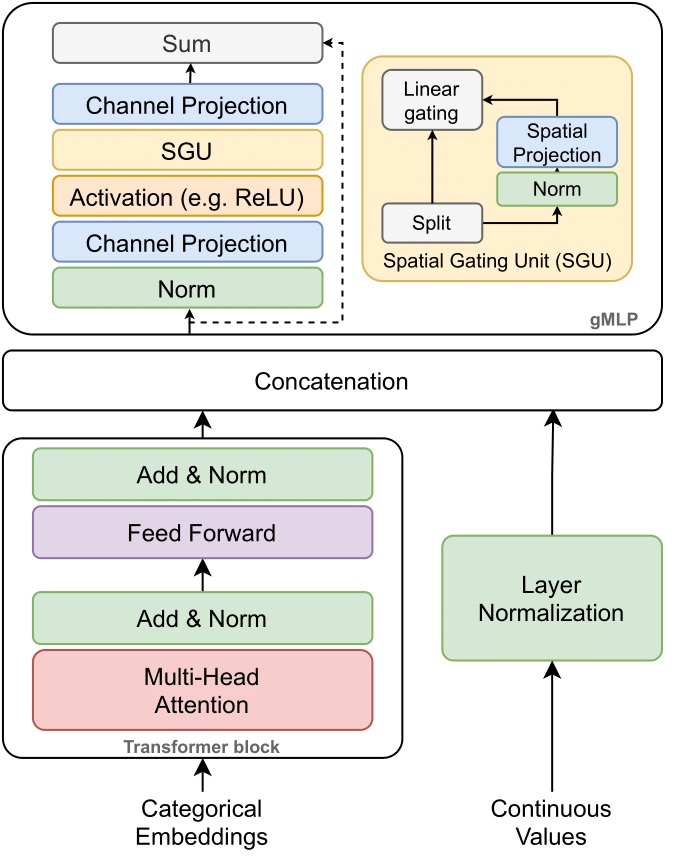

# The gated TabTransformer.

A deep learning tabular classification architecture inspired by [TabTransformer](https://arxiv.org/abs/2012.06678) with integrated [gated](https://arxiv.org/abs/2105.08050) multilayer perceptron.

</img>

## Usage

```python
model = TabTransformer(
    categories = n_categories,                          # tuple containing the number of unique values within each category
    num_continuous = train_cont.shape[1],               # number of continuous values
    transformer_dim = config["transformer_dim"],        # dimension, paper set at 32
    dim_out = 1,                                        # binary prediction, but could be anything
    transformer_depth = config["transformer_depth"],    # depth, paper recommended 6
    transformer_heads = config["transformer_heads"],    # heads, paper recommends 8
    attn_dropout = config["dropout"],                   # post-attention dropout
    ff_dropout = config["dropout"],                     # feed forward dropout
    mlp_act = nn.LeakyReLU(config["relu_slope"]),       # activation for final mlp, defaults to relu, but could be anything else (selu, etc.)
    mlp_depth=config["mlp_depth"],                      # mlp hidden layers depth
    mlp_dimension=config["mlp_dimension"],              # dimension of mlp layers
    gmlp_enabled=config["gmlp_enabled"]                 # gmlp or standard mlp
)
```

## Citation

```
@software{gTabTransformer,
  author = {{Radostin Cholakov, Todor Kolev}},
  title = {The gated TabTransformer.},
  url = {https://github.com/radi-cho/gTabTransformer},
  version = {0.0.1},
  date = {2021-12-15},
}
```